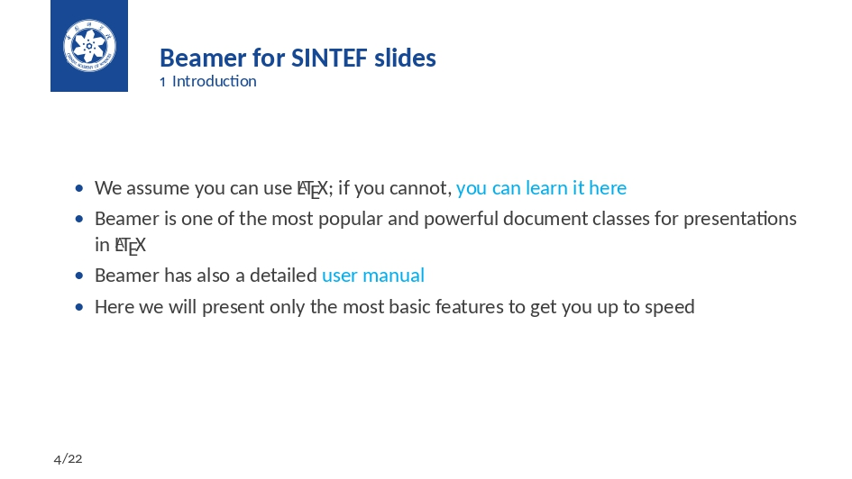

# UCAS-beamer
An unofficial LaTeX beamer template for UCAS

## Introduction
This template is a based on [SINTEF Presentation](https://www.overleaf.com/latex/templates/sintef-presentation/jhbhdffczpnx) from \hrefcol{mailto:federico.zenith@sintef.no}{Federico Zenith} and its derivation \hrefcol{https://github.com/TOB-KNPOB/Beamer-LaTeX-Themes}{Beamer-LaTeX-Themes} from Liu Qilong

Style adaptation contributed by [wzl-plasmid（普通质粒）](https://github.com/wzl-plasmid)

In the following you find a brief introduction on how to use `LaTeX` and the beamer package to prepare slides, based on the one written by [Federico Zenith](mailto:federico.zenith@sintef.no) for [SINTEF Presentation](https://www.overleaf.com/latex/templates/sintef-presentation/jhbhdffczpnx)

## Compilation
Compile ONCE with `XeLaTeX`

## Demo
See the PDF file in this repository. Here are a few screenshots of this template:

